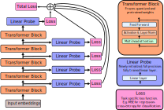
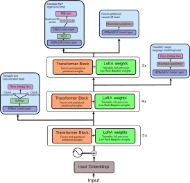

# Transformer Heads
This library aims to be an allround toolkit for attaching, training, saving and loading of new heads for transformer models.  
A new head could be: 
* A [linear probe](https://arxiv.org/pdf/1610.01644.pdf) used to get an understanding of the information processing in a transformer architecture
* A head to be finetuned jointly with the weights of a pretrained transformer model to perform a completely different kind of task.
    - E.g. a transformer pretrained to do causal language modelling could get a sequence classification head attached and be finetuned to do sentiment classification.
    - Or one could attach a regression head to turn a large language model into a value function for a reinforcement learning problem.

On top of that, attaching multiple heads at once can make multi-task learning easy, making it possible to train very general models.

Check out the api [documentation at Read the Docs](https://transformer-heads.readthedocs.io/en/latest/).


## Installation
Install from pypi: `pip install transformer-heads`.

Or, clone this repo and from the root of this repository:
`pip install -e .`

## Usage
Create head configurations
```python
head_config = HeadConfig(
    name=f"imdb_head_3",
    layer_hook=-3,
    in_size=hidden_size,
    output_activation="linear",
    pred_for_sequence=True,
    loss_fct="cross_entropy",
    num_outputs=2,
)
```
Create a model with your head from a pretrained transformer model
```python
model = load_headed(
    LlamaForCausalLM,
    "meta-llama/Llama-2-7b-hf",
    head_configs=[heads_config],
)
```
Train you model using (for example) the simple to use huggingface *Trainer* interface:
```python
trainer = Trainer(
    model,
    args=args,
    train_dataset=imdb_dataset["train"],
    data_collator=collator,
)
```

For a more in-depth introduction and a fully working example, check the [linear probe notebook](notebooks/gpt2/linear_probe.ipynb).

## Joint training of multiple linear probes


## Notebooks
This repository contains multiple jupyter notebooks for a tutorial/illustration of how do do certain things with this library. Here is an overview of which notebook you should check out depending on the use you are interested in.
* Linear Probes (understanding the inner workings of transformers)
    - Basic example with one probe for causal LM: [notebooks/gpt2/linear_probe.ipynb](notebooks/gpt2/linear_probe.ipynb)
    - Train many probes for causal LM at once: [notebooks/gpt2/multi_linear_probe.ipynb](notebooks/gpt2/multi_linear_probe.ipynb)
    - Train many probes for text classification at once: [notebooks/gpt2/text_classification_linear_probe.ipynb](notebooks/gpt2/text_classification_linear_probe.ipynb)
* Finetuning on a new type of task (with a new head)
    - QLoRA: [notebooks/gpt2/text_classification_qlora.ipynb](notebooks/gpt2/text_classification_qlora.ipynb)
    - Full finetuning: [notebooks/gpt2/text_classification_full_finetune.ipynb](notebooks/gpt2/text_classification_full_finetune.ipynb)
* Joint multi-task learning
    - Many heads doing completely different tasks + QLoRA, all trained at the same time: [notebooks/gpt2/joint_multitask_learning.ipynb](notebooks/gpt2/joint_multitask_learning.ipynb)
* Regression with pretrained transformers
    - Check the regression heads of this notebook: [notebooks/gpt2/joint_multitask_learning.ipynb](notebooks/gpt2/joint_multitask_learning.ipynb)
* Saving and loading
    - Notebook: [notebooks/gpt2/saving_and_loading.ipynb](notebooks/gpt2/saving_and_loading.ipynb)
    - Tests: [transformer_heads/tests/test_load_model.py](transformer_heads/tests/test_load_model.py)

## Joint multi-task training with different types of heads and QLoRA.
